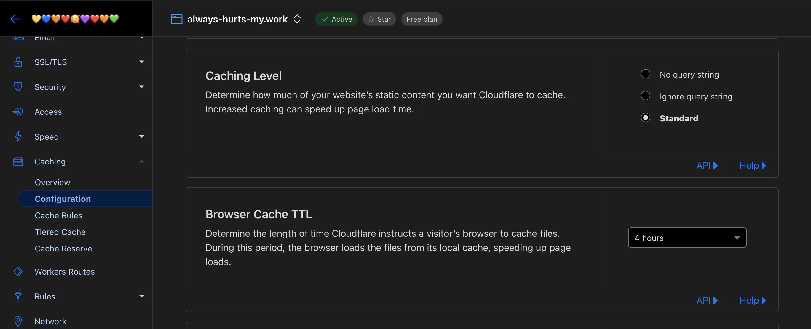

# cloudflare-pages-headers-cache-control-repro

## Problem

I use `_headers` to modify response headers of cloudflare pages static assets[^1], but when I apply custom domain to the cloudflare pages, the `max-age` value in `cache-control` of response header will not be an expected value.

[^1]: https://developers.cloudflare.com/pages/configuration/headers/

```sh
$ curl -sI 'https://cloudflare-pages-headers-cache-control-repro.pages.dev/max-age/a.js' | grep cache
cache-control: max-age=60

$ curl -sI 'https://cloudflare-pages-headers-cache-control-repro.always-hurts-my.work/max-age/a.js' | grep cache
cache-control: max-age=14400
cf-cache-status: REVALIDATED
```

## Solution

14400 seconds is equal to 4 hours, which is shown on domain dashboard > `Caching` > `Configuration` > `Browser Cache TTL`.


